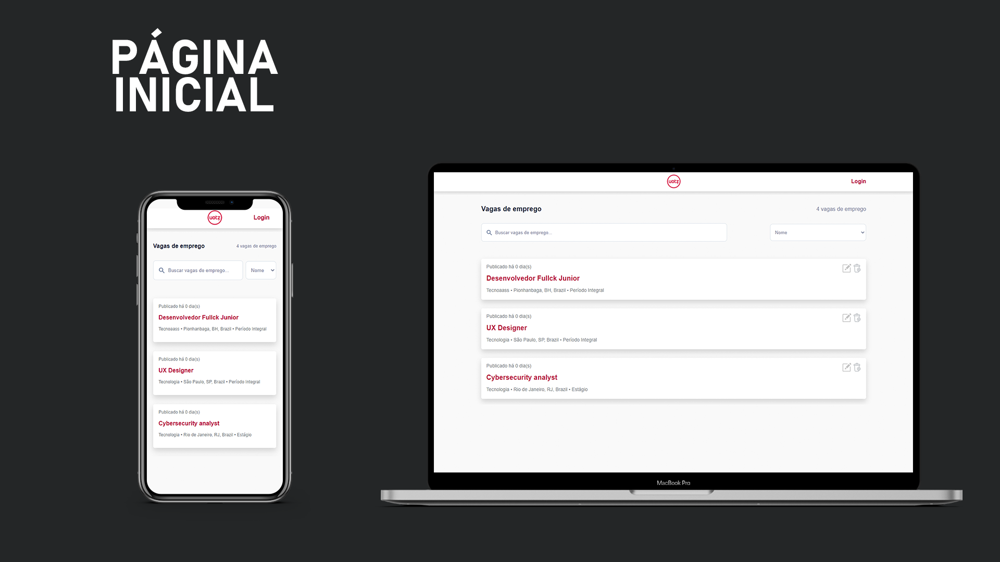
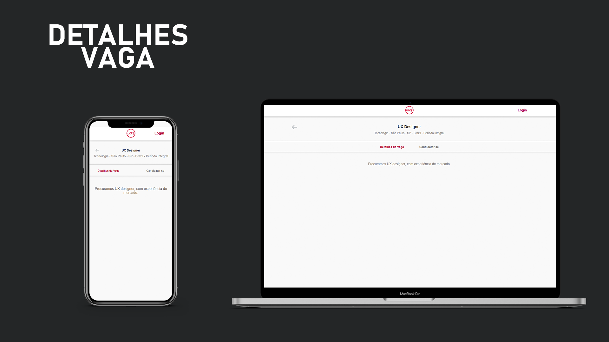
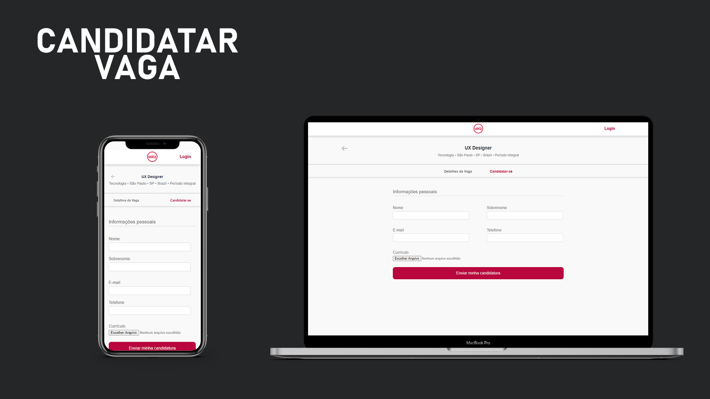
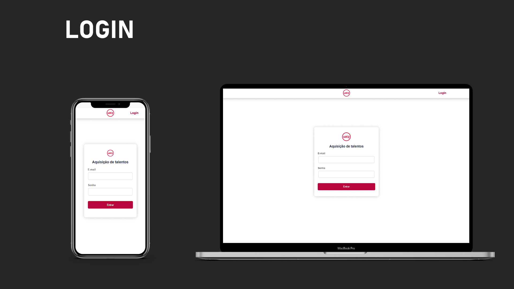
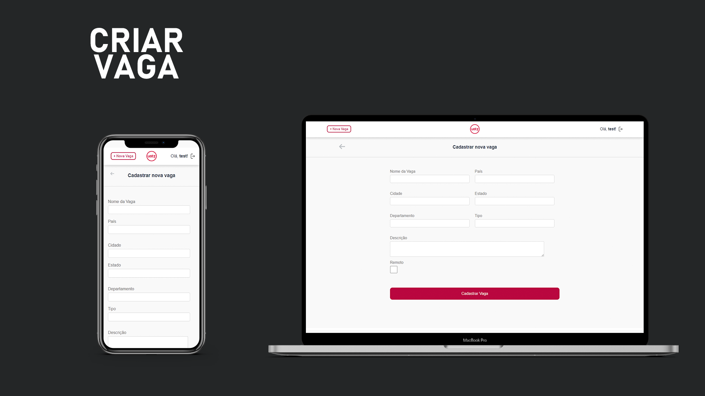

# Carreirasfront
Interface desenvolvida para o projeto Carreiras, uma plataforma na qual pode-se divulgar vagas de empregos, ou aplicar-se para uma vaga.

## Instalação e configurações
* A interface utiliza Docker e Docker compose, logo, para subir a aplicação, basta buildar as imagens presentes no `Dockerfile` e `docker-compose.yml`.

## Tecnologias
- Vue 2.6
- Vue router 3.2

#### Screenshots e telas

#### Página Inicial
  
Ná página inicial, são listadas todas as vagas, oferecendo ao usuário um campo de pesquisa para filtrar as vagas de seu interesse.
Ao clicar em um card o usuário é levado a uma página contendo mais detalhes da vaga.

#### Vaga

  
Nesta página, são exibidos detalhes da vaga, também há um formulário no qual o usuário pode candidatar-se a vaga, inserindo suas informações e seu currículo.

#### Login
  
O login, fornece ao usuário o controle da aplicação, podendo inserir, remover ou atualizar as vagas.

#### Criar vaga
  
Após a autenticação, o usuário pode criar novas vagas através do formulário de criação.
Também é possivel atualizar vagas já existentes, ou exclui-lás.

#### Todo
- [ ] Implementação de rich text editor -> Melhor diagramação e visualização das descrições das vagas.
- [ ] Implementação de uma interface para visualização das aplicações para cada vaga -> Usuário poderá listar todas as aplicações de cada vaga, e realizar o download do arquivo de currículo.